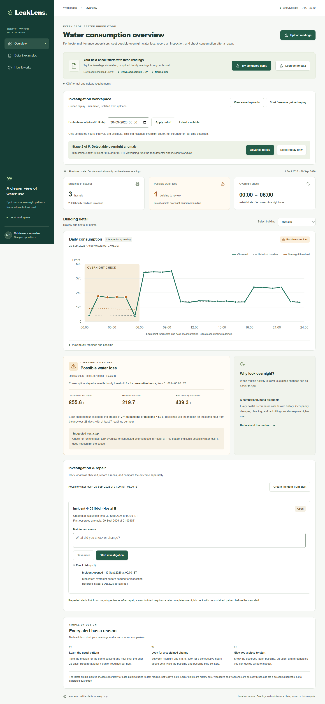
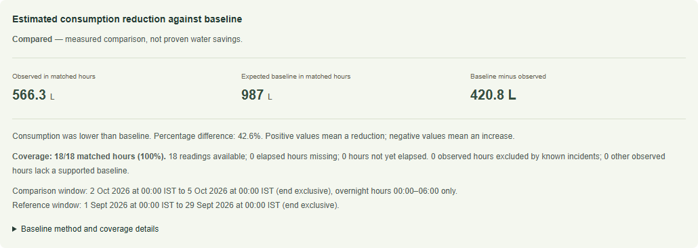
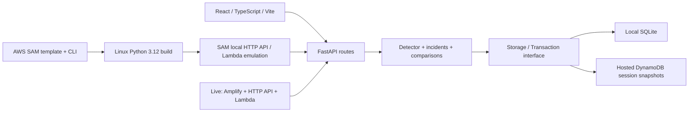

# LeakLens

**Help hostel maintenance supervisors turn unexplained overnight water use into an investigation and an honest post-repair comparison.**

LeakLens accepts hourly consumption CSVs, explains unusual overnight patterns, records maintenance decisions, and compares available post-repair readings with historical expectations. It flags **possible water loss**, never confirmed leaks. No sensors, chatbot, account setup, or cloud account is needed for the local demo.

**Live demo:** [https://demo.d2gicx0vj4suvu.amplifyapp.com](https://demo.d2gicx0vj4suvu.amplifyapp.com). Choose **Try simulated demo** and advance through all five stages. Each browser session is temporary and isolated; use simulated/non-sensitive data.

**Source:** [yaswanth-reddy14/LeakLens](https://github.com/yaswanth-reddy14/LeakLens). The demo video link is **pending**.

Amplify uses **manual artifact deployment**. Pushing this repository does not build or redeploy the hosted app.



## Try it on Windows

Prerequisites: Python 3.11+, Node 22.12+, and the repository dependencies. From this directory, first-time setup:

```powershell
python -m venv .venv
.\.venv\Scripts\python.exe -m pip install -r backend\requirements.txt
# If using this workspace's existing portable Node:
$env:Path = "$PWD\.tools\node-v22.23.3-win-x64;$env:Path"
npm.cmd ci
```

With the existing environment, the complete launch command is:

```powershell
powershell -NoProfile -ExecutionPolicy Bypass -File scripts/start-demo.ps1 -ResetDemo
```

Open **http://127.0.0.1:5180** and click **Try simulated demo**. Advance through normal operation, anomaly, investigation, repair recorded, and post-repair monitoring. All scenario readings are simulated. **Load demo data** remains a quick single-night sample. **Upload readings** accepts your own CSV; **Download sample CSV** provides a reproducible example.

The launcher builds a recording frontend bundle, then serves it with a local preview server using `data/recording.sqlite3` and loopback ports 5180/8010. It preserves the original workspace on 5173/8000, reuses only its recorded processes and refuses occupied ports. Stop/start after source changes to rebuild the recording bundle. Scripts do not modify system execution policy. To stop only the recording services:

```powershell
powershell -NoProfile -ExecutionPolicy Bypass -File scripts/stop-demo.ps1
```

To reset/seed only the recording replay (uploaded readings/incidents stay intact):

```powershell
.\.venv\Scripts\python.exe scripts/reset_demo.py --stage 0
```

After a reset, click **Try simulated demo** to refresh the browser's saved cutoff. Stages 0–4 can be seeded for rehearsal. The in-app **Reset replay only** also resets safely. For manual local startup, macOS/Linux commands and detailed methodology, see [method and setup](docs/METHOD_AND_SETUP.md).

## What works

- Atomic CSV validation and persistence; identical repeat uploads are idempotent, conflicting existing values reject the entire upload.
- Building selector, hourly chart and accessible data table, explicit liters and Asia/Kolkata timestamps.
- Historical cutoffs with no future readings in the chart, detector, or comparison.
- Explainable baseline, observed consumption, threshold, duration and missing-history states.
- Open → Investigating → Repaired incidents, notes, audit history, deduplication and recurrence rules.
- Comparison over three complete post-repair nights; known incidents excluded from baseline, no missing-value extrapolation.
- Isolated five-stage replay; desktop/mobile layouts, keyboard and automated accessibility checks.



[Mobile screenshot](docs/screenshots/mobile-anomaly.png) · [Full outcome screenshot](docs/screenshots/desktop-outcome.png). These are captures of the running app, not design mockups.

## Architecture and meaningful AWS integration



AWS SAM defines and builds the Python Lambda package and HTTP API. A separate **local-only** template runs the actual Mangum Lambda handler in a Linux container and tests the full workflow with a writable, isolated `/tmp` SQLite database. It does not access production DynamoDB. Production requires DynamoDB with conditional atomic writes, private temporary bearer sessions, TTL cleanup, restricted IAM, exact-origin CORS, throttling and CloudWatch logging.

[Local SAM commands and evidence](docs/SAM_LOCAL.md) · [AWS deployment preparation](AWS_DEPLOYMENT.md). The hosted target is manual Amplify upload plus SAM backend deployment; GitHub is not needed to deploy. **Amplify and the backend are live in Sydney.** On 8 October 2026, real Chromium checks passed upload, incident investigation/repair, reload persistence, all five replay stages, repair comparisons, two-session isolation, reset boundaries, exact-origin CORS, and desktop/mobile accessibility. These checks used the deployed API and DynamoDB, not mocks. See [verification record](docs/VERIFICATION.md) for executed checks and boundaries.

## Evaluation, including the misses

Reproduce the labeled synthetic benchmark:

```powershell
.\.venv\Scripts\python.exe -m backend.evaluate
```

Forty tuning scenarios select only the comparator's fixed threshold; 100 separate held-out scenarios cover morning peaks, sustained increases, gradual small increases, missing readings and legitimate overnight use. Production detector thresholds remain unchanged.

| Method                      |  TP |  FP |  TN |  FN | Precision | Recall |
| --------------------------- | --: | --: | --: | --: | --------: | -----: |
| Historical detector         |  20 |  10 |  40 |  30 |     0.667 |  0.400 |
| Fixed 100 L/hour comparator |  35 |  25 |  25 |  15 |     0.583 |  0.700 |

The current detector reduces false alarms on varying building baselines but misses small rises and incomplete runs. The comparator has higher recall and F1 on this constructed set. Neither can distinguish a scheduled overnight activity from a leak using consumption alone. **These are synthetic screening results, not real-world accuracy.** [Full method, delay definition, per-family results and limitations](docs/EVALUATION.md) · [Machine-readable results](docs/evaluation-results.json).

## Data and evidence assumptions

```csv
building_id,timestamp,consumption_liters
Hostel A,2026-09-29T01:00:00+05:30,48.5
```

Each row is consumption during one hour, not a cumulative meter. Explicit timezone offsets are mandatory; timestamps must align to whole hours in Asia/Kolkata. Baseline: same building and hour, median of the preceding 28 days, at least 7 samples per hour. A sustained alert requires 3 consecutive overnight hours above both twice the baseline and baseline + 50 liters. Nights become eligible only after their 06:00 boundary is supported by completed readings; this is not real-time detection.

A recorded repair is a human action, not proof of improvement. Verification requires 18 matched hours across three full nights, sufficient clean history and no known incident overlaps. Missing readings are never zero-filled or extrapolated. The label is **estimated consumption reduction against baseline**, not proven water savings. Occupancy, scheduled use, seasonality, unrecorded incidents and meter error can all change outcomes. No annual projections, financial savings, field validation or measured environmental impact is claimed.

Local use has no authentication. Hosted sessions are temporary bearer credentials, not production accounts; data expires after 24 hours. The hosted adapter intentionally caps session size to preserve atomicity. Detailed limits, costs, and resource deletion steps are in [AWS_DEPLOYMENT.md](AWS_DEPLOYMENT.md#8-cleanup-after-the-hackathon).

## Check and submit

```powershell
.\.venv\Scripts\python.exe -m pip install -r backend\requirements-aws-test.txt
.\.venv\Scripts\python.exe -m pytest backend/tests -q
npm.cmd run build
npx.cmd playwright install chromium
npm.cmd run test:e2e
npm.cmd run format:check
powershell -NoProfile -ExecutionPolicy Bypass -File scripts/build-sam.ps1
```

Tests use dedicated ports 5174/5175/8001; AWS adapter tests use Moto, not AWS. SAM requires Docker's Linux engine. No account login is needed for the credential-isolated local SAM scripts.

Submission materials: [writeup](docs/SUBMISSION.md), [under-three-minute narration](docs/DEMO_SCRIPT.md), [recording checklist](docs/DEMO_CHECKLIST.md), [interview preparation](docs/INTERVIEW_PREP.md), [final manual checklist](docs/FINAL_CHECKLIST.md), [credits](docs/CREDITS.md).

**Event eligibility is unconfirmed.** The event lists SAM CLI as a local open-source option, but you must confirm the integration and your build timeline with the organizers. The rules disallow projects begun before the event. Complete registration/verification and review the current full rules before submitting. The project was developed locally before Git initialization; publication does not change that build history.

## Repeat the live verification

This creates disposable synthetic data in new 24-hour hosted sessions and makes billable AWS requests. It does not reset existing visitors. Credentials, HAR files, traces and storage exports are not recorded.

```powershell
node scripts/verify-hosted.mjs https://demo.d2gicx0vj4suvu.amplifyapp.com
```

Requires the existing Playwright/Chromium dependencies. A sanitized result and screenshots are written to `.tools/hosted-verification/`. The seven ordinary local/mock browser tests remain separate: `npm.cmd run test:e2e`. Real phones, other browser engines, 24-hour expiry/TTL cleanup, load testing and production authentication are outside the verified scope.
